# 🐧 Linux Para Principiantes – Curso Completo

**Autor:** DeciLearn  
📺 **YouTube:** [Ver Curso Completo](https://www.youtube.com/watch?v=jVQKk8IB9pA&t=553s)

---

## 🧠 ¿Qué es Linux?

Linux es el **kernel** (núcleo) del sistema operativo.  
Es el encargado de coordinar y gestionar la comunicación entre el **hardware** y el **software**.

> Linux está basado en UNIX, un sistema operativo robusto y seguro.  
> A diferencia de UNIX, Linux es **open source** (código abierto), lo que permite que cualquier persona lo estudie, modifique y distribuya.

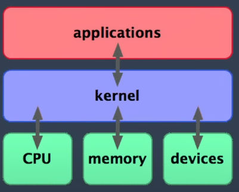

---

## 📦 Distribuciones de Linux

Una **distribución** de Linux es una colección de software open source que incluye el kernel de Linux, herramientas de sistema, entornos de escritorio, y más.

Cualquiera puede combinar diferentes paquetes y crear su propia distribución.

Ejemplos populares: Ubuntu, Debian, Fedora, Arch Linux.

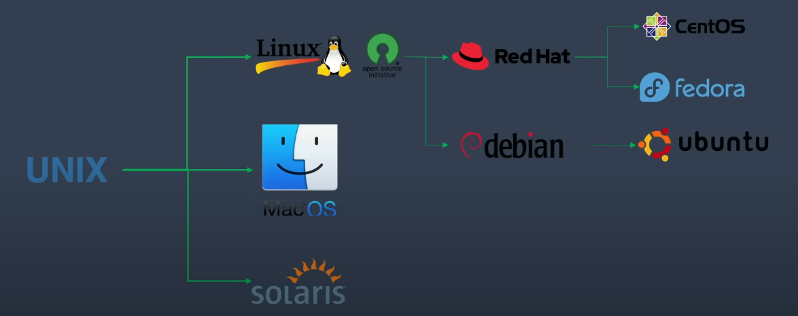

---

## 📁 Unificación del Sistema de Archivos

En Linux, **todo es un archivo**: desde carpetas, documentos y comandos hasta dispositivos físicos como discos y puertos.

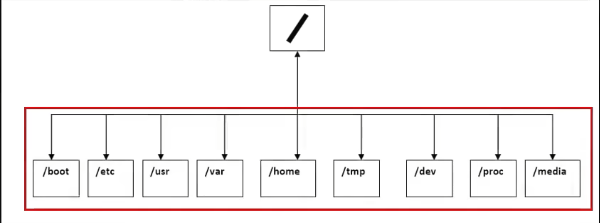  

---

## 💻 Interfaces en Linux

Linux ofrece dos tipos principales de interfaces de usuario:

1. **GUI (Graphical User Interface):** Entorno gráfico como GNOME, KDE, XFCE.
2. **CLI (Command Line Interface):** Terminal de comandos para interacción directa.

---

## 🧩 Instalación de Ubuntu 24.04.2

Una distribución muy popular para principiantes es **Ubuntu**.

### 📂 Cómo abrir la terminal

Atajo de teclado:

# Ubuntu

Para abrir una terminal podemos utlizar el comando 

Control + Alt + T

En la terminal aparece 

user@server:~$

user: Se refiere al usuario
server: Nombre de la maquina
~$: Es el directorio actual ($ es un usuario avitual)

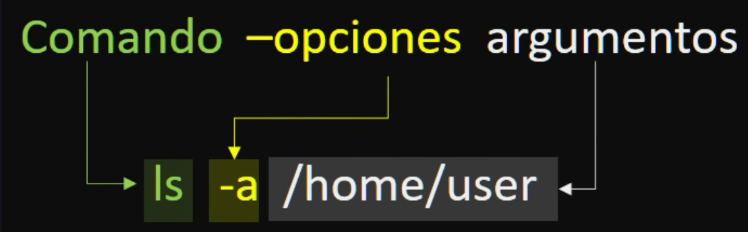

# pwd
imprime directorio de trabajo actual

El directoria de inicio de un usuario es 

/home/user

Este es el directorio donde un usuario normal puede crear archivos

La / puede tiene dos funciones en nuestro ejemplo:

 1. La primera / es la raiz
 2. La segunda / es el separador

# ls

Es un comando que nos lista los archivos o carpertas del directorio actual.

  # ls -l
  Esta nos da una lista detallada o lista larga

  # ls -a    o    ls --all
  Esta nos la una lista completa hasta los archivos ocultos

  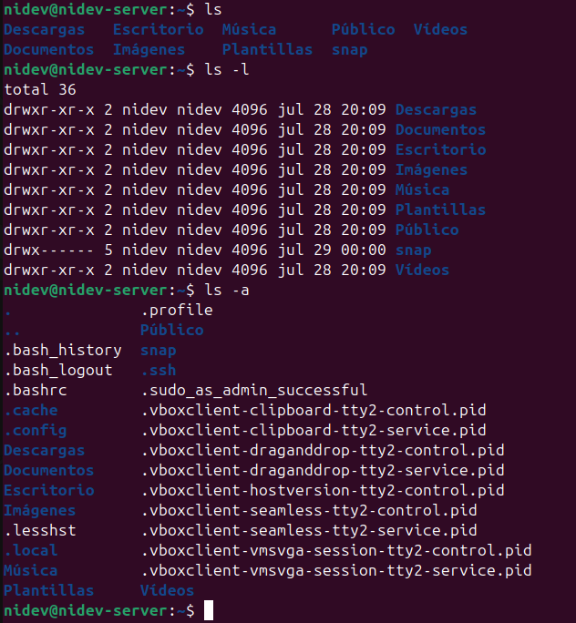
  
  # ls -1
  Esta nos la una lista en forma de lista

  # ls -h
  Esta nos la una lista mas ordenada y visualmente con la capacidad del archivo

  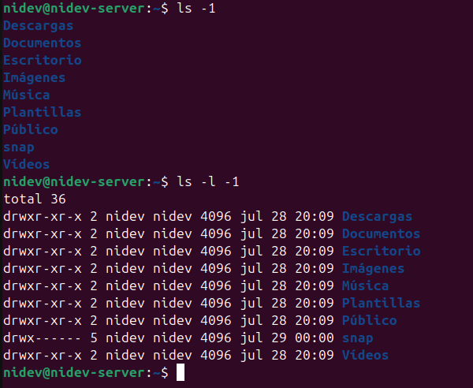

  # ls Pruebas/Pruebas1

  Ruta relativa o corta:
  Este no es necesarioq ue empurce de lraiz pero desde tu directorio actual para adelante

  Ruta absoluta o larga:
  Siempre empieza por la raiz (/) nos ayuda a direccionar si esta en otro directorio

  # ls -la Pruebas/Pruebas1/ /etc/apt
  Eso nos mostrar la lista de larga de ambos directorioS

# cd
Este comando nos permite cambiar directorio, este comando recibe como argumento una ruta, este comadno puede ser para una ruta relativo o absoluta

  # cd Pruebas
  Aqui dice que entramos a dorectorio Pruebas

  # cd .. 
  Aqui dice que salgamos al directorio padre del directorio actual

  # cd ../../..
  Aqui puede saltar hasta 3 directorios padres

  

  # cd -
  Nos da al directorio anterios

# Touch 
Este comando nos permite cambiar la fecha de un documento 

  # touch -d '15 Nov' Prueba/Prueba1/archivo.txt
  Aqui le cambia la fecha al 15 Nov al archivo.txt

  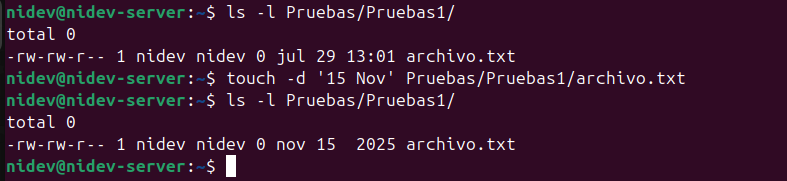

# rm
Este elimina sin manera de recuperar

# mkdir
este nos permite directorios

  # mkdir -p DirectorioPueba/Prueba1/Prueba2
  Este comando nos permite crear directorios asi

  # mkdir -p DirectorioPueba/{Prueba1, Prueba2}
  Este nos permite crear varios directorios en un directorio actual

  # ls -R DiretorioPueva/
  Para listar todos y detallado

  # rmdir Prrueba2
  Es para eliminar directorios vacios, si tiene algun contenido no te permitira

  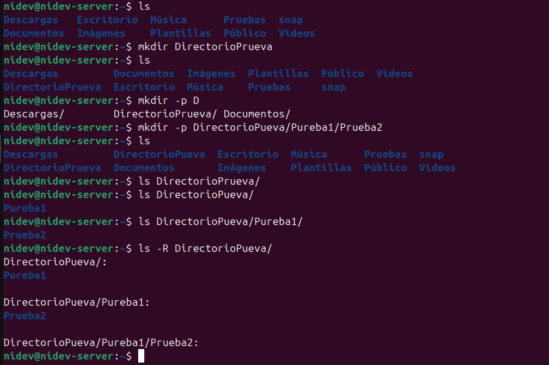

  # rm -r Prueba2
  Esto nos alimina todo un directorio y su contenido

# cp
Este comando te permite copiar archivos

  # cp archivo.text archivoCopiado.txt
  Aqui copiamos el archivo

  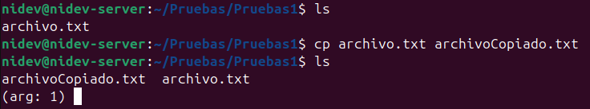

  # cp archivoCopiado.txt /Docuemntos/
  Aqui copia el archivo a un directorio (El directorio tiene que estar dentro)

  # cp archivoCopiado.txt Documentos/archivoDocumentos.txt
  Aqui le pasamos una copia a un directorio con un neuvo nombre de archivoDocumentos

  # cp students.text teachers.text /Documentos
  Aqui podemos pasar dos archuvos a un diretorio de la misma manera

  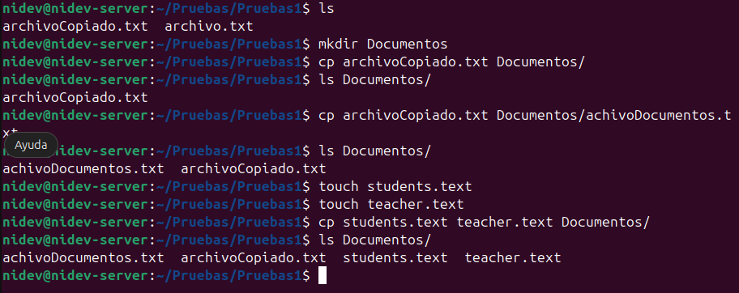

# cat
Este comando nos permite crear, modificar y concatenar archivos.

  # cat pass.txt
  Nos permite ver el contenido

  # cat -n pass-txt
  Esto nos permite crear listar los elementos de ese archivo

  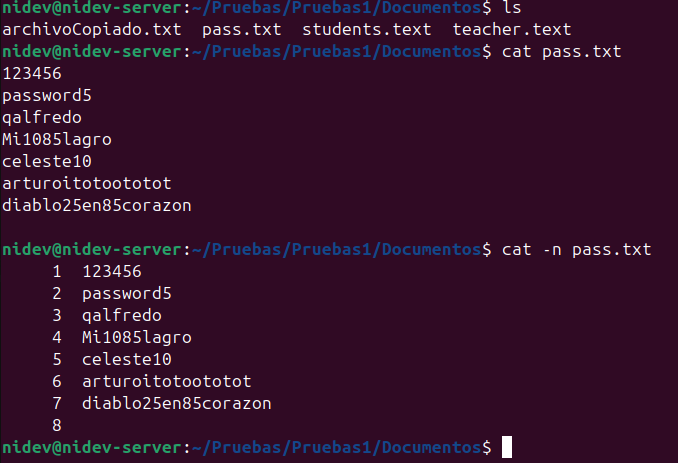

  # cat>archivo
  creamos el archivo y escribimos algo de contenido el archivo no tiene una extension

  # cat pass.txt archivo 
  Aqui esta concatenando ambos archivos

  # cat archivo > prueba1
  Aqui esta sobreescribiendo el contenido de prueva a ese archivo 

  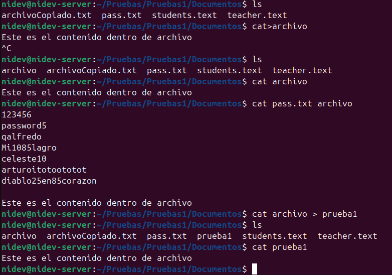

  # cat archivo pass.text>prueba2
  Aqui essta copiando el contenido a un archivo puureba2

  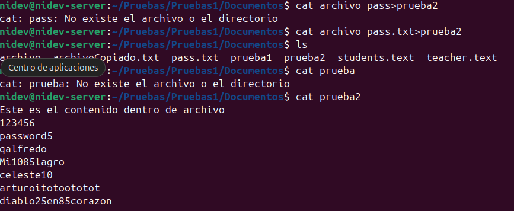

# nano
Este comando tambien nos permite realizar o modificar archivos

# vi 
Este comando tambien es para escribir o modificar un archivo

# alias
Es una tajo de un comando

stdin (entrada eestandar)
stdout (salida estandar) 

2:50

