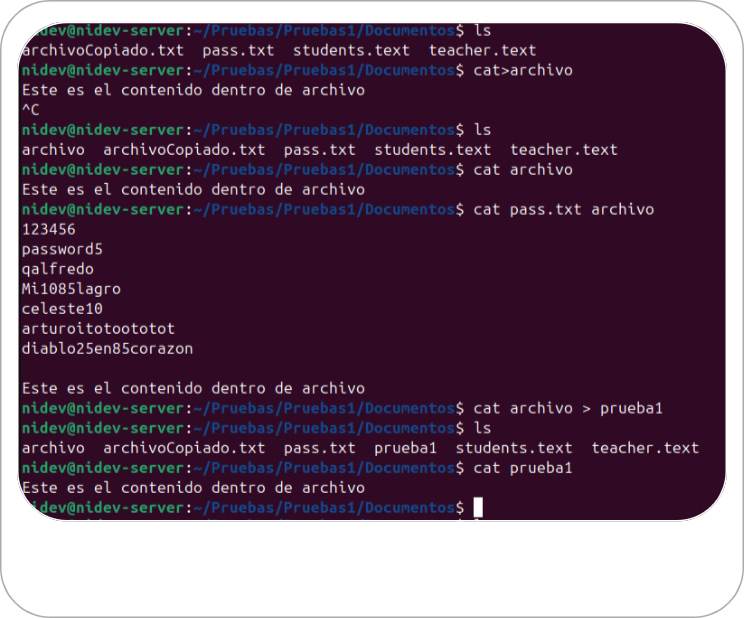

# aprendiendo-ciberseguridad

This repository contains cybersecurity projects.

## Projects List

[Ubuntu](https://learning-cybersecurity/00_Ubuntu): Curso completo sobre ubuntu.
[Hacker Etico](https://learning-cybersecurity/01_hacker-etico): Curso de Cisco sobre Hacker Etico.  

Click any of the images below to view the readme and live demo of the project.

  
  

